# Mailviz Database Schema

Generated from `server/src/prisma/schema.prisma`. PostgreSQL 16, accessed through
Prisma. **22 models and 1 enum** (`TaskPriority`) as of migration
`20260816120000_drop_pre_user_scoping_unique_indexes`.

If you change `schema.prisma`, update this file in the same commit.

## Entity Relationship Diagram

```mermaid
erDiagram
    User ||--o| GoogleAuth : "has"
    User ||--o{ Task : "owns"
    User ||--o{ Customer : "owns"
    User ||--o{ Label : "owns"
    User ||--o{ Email : "owns"
    User ||--o{ CalendarEvent : "owns"
    User ||--o{ TaskStatus : "owns"
    User ||--o{ CompanyCategory : "owns"
    User ||--o{ DealPartner : "owns"
    User ||--o{ Deal : "owns"
    User ||--o{ ScheduledEmail : "owns"
    User ||--o{ AuditLog : "acted"
    User ||--o{ Notification : "receives"
    User ||--o{ Task : "assigned to"
    User ||--o{ EmailThreadShare : "shares sent"
    User ||--o{ EmailThreadShare : "shares received"
    User ||--o{ DealShare : "shares sent"
    User ||--o{ DealShare : "shares received"
    User ||--o{ TaskShare : "shares sent"
    User ||--o{ TaskShare : "shares received"

    Customer ||--o{ Contact : "has"
    Customer ||--o{ Task : "linked"
    Customer ||--o{ Email : "linked"
    Customer ||--o{ Deal : "linked"
    Customer ||--o{ CalendarEventCustomer : "linked"
    Customer }o--o| CompanyCategory : "categorized"

    Task ||--o{ TaskLabel : "has"
    Task ||--o| MailToTask : "from email"
    Task ||--o{ TaskShare : "shared"

    Label ||--o{ TaskLabel : "applied to"

    Email ||--o{ EmailAttachment : "has"
    Email ||--o| MailToTask : "converted to task"
    Email ||--o{ ScheduledEmail : "reply to"

    CalendarEvent ||--o{ CalendarEventCustomer : "linked"

    DealPartner ||--o{ Deal : "has"
    Deal ||--o{ DealShare : "shared"

    User {
        uuid id PK
        varchar email UK
        varchar name
        varchar avatar_url
        text signature
        timestamp created_at
        timestamp updated_at
    }

    GoogleAuth {
        uuid id PK
        text access_token
        text refresh_token
        timestamp token_expiry
        varchar email
        text scope
        timestamp last_sync_at
        timestamp last_mail_sync_at
        varchar last_history_id
        text calendar_sync_token
        uuid user_id FK "unique — 1:1 with User"
        timestamp created_at
        timestamp updated_at
    }

    Task {
        uuid id PK
        varchar title
        text description
        varchar status "FK-by-name to task_statuses.name"
        enum priority "LOW|MEDIUM|HIGH|URGENT"
        timestamp due_date
        int position
        int estimated_minutes
        uuid customer_id FK
        uuid assigned_to_id FK
        uuid user_id FK
        timestamp created_at
        timestamp updated_at
    }

    TaskStatus {
        uuid id PK
        varchar name "unique per user"
        varchar label
        varchar color
        int position
        uuid user_id FK
        timestamp created_at
    }

    CompanyCategory {
        uuid id PK
        varchar name "unique per user"
        varchar label
        varchar color
        int position
        uuid user_id FK
        timestamp created_at
    }

    Customer {
        uuid id PK
        varchar name
        varchar email
        varchar phone
        varchar company
        varchar website
        varchar domain "unique per user"
        varchar logo_url
        text notes
        uuid category_id FK
        boolean is_vip
        boolean is_internal
        uuid user_id FK
        timestamp created_at
        timestamp updated_at
    }

    Contact {
        uuid id PK
        varchar first_name
        varchar last_name
        varchar email
        varchar phone
        varchar role
        boolean is_vip
        uuid customer_id FK
        timestamp created_at
        timestamp updated_at
    }

    Label {
        uuid id PK
        varchar name "unique per user"
        varchar color
        uuid user_id FK
        timestamp created_at
    }

    TaskLabel {
        uuid task_id PK "FK -> tasks.id"
        uuid label_id PK "FK -> labels.id"
    }

    Email {
        uuid id PK
        varchar gmail_message_id "unique per user"
        varchar thread_id
        varchar subject
        varchar from
        varchar from_name
        array to
        array cc
        array bcc
        varchar message_id "RFC 5322 Message-ID"
        varchar in_reply_to
        text references
        text snippet
        text body
        timestamp received_at
        boolean is_read
        boolean is_starred
        boolean is_archived
        boolean is_trashed
        boolean has_attachment
        int size_estimate
        array label_ids
        timestamp synced_at
        uuid customer_id FK
        uuid user_id FK
        timestamp created_at
    }

    EmailAttachment {
        uuid id PK
        uuid email_id FK
        varchar gmail_attachment_id
        varchar filename
        varchar mime_type
        int size
    }

    MailToTask {
        uuid id PK
        uuid email_id FK "unique"
        uuid task_id FK "unique"
        text conversion_note
        timestamp created_at
    }

    CalendarEvent {
        uuid id PK
        varchar google_event_id "unique per user"
        varchar title
        text description
        timestamp start_time
        timestamp end_time
        varchar location
        boolean is_all_day
        varchar calendar_id
        varchar color_id
        jsonb attendees
        varchar conference_link
        varchar recurring_event_id
        array recurrence "RRULE strings"
        jsonb reminders "useDefault + overrides[]"
        varchar visibility "default|public|private|confidential"
        timestamp synced_at
        uuid user_id FK
        timestamp created_at
        timestamp updated_at
    }

    CalendarEventCustomer {
        uuid calendar_event_id PK "FK -> calendar_events.id"
        uuid customer_id PK "FK -> customers.id"
    }

    DealPartner {
        uuid id PK
        varchar name "unique per user"
        varchar registration_url
        varchar logo_url
        uuid user_id FK
        timestamp created_at
    }

    Deal {
        uuid id PK
        varchar title
        uuid partner_id FK
        uuid customer_id FK
        text products
        varchar status "TO_CHALLENGE|APPROVED|DECLINED"
        timestamp expiry_date
        text notes
        uuid user_id FK
        timestamp created_at
        timestamp updated_at
    }

    EmailThreadShare {
        uuid id PK
        varchar thread_id
        uuid shared_by_user_id FK
        uuid shared_with_user_id FK
        timestamp created_at
    }

    DealShare {
        uuid id PK
        uuid deal_id FK
        uuid shared_by_user_id FK
        uuid shared_with_user_id FK
        timestamp created_at
    }

    TaskShare {
        uuid id PK
        uuid task_id FK
        uuid shared_by_user_id FK
        uuid shared_with_user_id FK
        timestamp created_at
    }

    ScheduledEmail {
        uuid id PK
        uuid user_id FK
        varchar status "pending|sent|failed|cancelled"
        timestamp send_at
        varchar mode "new|reply|forward"
        array to
        array cc
        array bcc
        varchar subject
        text html_body
        json attachments
        uuid reply_to_email_id FK
        array forward_existing_attachments
        varchar sent_message_id
        varchar sent_thread_id
        text error_message
        int retry_count
        timestamp created_at
        timestamp updated_at
    }

    AuditLog {
        uuid id PK
        uuid user_id FK
        varchar action "EMAIL_SENT, TASK_CREATED, ..."
        varchar entity_type
        varchar entity_id
        jsonb details
        varchar status "success|failure"
        timestamp created_at
    }

    Notification {
        uuid id PK
        uuid user_id FK
        varchar type "email|calendar|offline"
        varchar title
        text message
        varchar entity_type
        varchar entity_id
        boolean is_read
        boolean is_dismissed
        timestamp created_at
    }
```



## Summary

| Model | Table | Description | Scope |
|-------|-------|-------------|-------|
| **User** | `users` | Authenticated users (Google OAuth) | Multi-tenant root |
| **GoogleAuth** | `google_auth` | Encrypted Google tokens + sync cursors | 1:1 with User |
| **Task** | `tasks` | Tasks with priority, status, labels, assignment | Per-user |
| **TaskStatus** | `task_statuses` | Dynamic Kanban board columns | Per-user |
| **CompanyCategory** | `company_categories` | Company classification (Customer, Partner, Distributor) | Per-user |
| **Customer** | `customers` | Companies (auto-created from email domains) | Per-user |
| **Contact** | `contacts` | People within companies | Via Customer |
| **Label** | `labels` | Task tags/labels | Per-user |
| **Email** | `emails` | Synced Gmail messages | Per-user |
| **EmailAttachment** | `email_attachments` | File attachments on emails | Via Email |
| **CalendarEvent** | `calendar_events` | Synced Google Calendar events | Per-user |
| **Deal** | `deals` | Deal registrations with partners | Per-user |
| **DealPartner** | `deal_partners` | Partner vendors (IBM, RedHat, …) | Per-user |
| **ScheduledEmail** | `scheduled_emails` | Emails queued for future sending | Per-user |
| **AuditLog** | `audit_logs` | Append-only record of user actions | Per-user |
| **Notification** | `notifications` | In-app notification feed (read/dismissed flags) | Per-user |
| **EmailThreadShare** | `email_thread_shares` | Email thread sharing between users | Junction |
| **DealShare** | `deal_shares` | Deal sharing between users | Junction |
| **TaskShare** | `task_shares` | Task sharing between users | Junction |
| **MailToTask** | `mail_to_tasks` | Email → Task conversion link | Junction |
| **TaskLabel** | `task_labels` | Task ↔ Label many-to-many | Junction |
| **CalendarEventCustomer** | `calendar_event_customers` | Event ↔ Company many-to-many | Junction |

Enum: `TaskPriority` (`LOW`, `MEDIUM`, `HIGH`, `URGENT`) — the only enum in the
schema. `Task.status` and `Deal.status` are both `VARCHAR`, not enums.

## Key Design Decisions

- **Multi-tenant.** Every data model carries `userId` for tenant isolation, and
  deleting a `User` cascades to all of it.
- **Per-user compound uniques.** `@@unique([userId, name])` on `TaskStatus`,
  `CompanyCategory`, `Label` and `DealPartner`; `@@unique([userId, domain])` on
  `Customer`; `@@unique([userId, gmailMessageId])` on `Email`;
  `@@unique([userId, googleEventId])` on `CalendarEvent`. **These are the only
  uniques on those columns that should exist** — see the trap below.
- **Task statuses are dynamic, not an enum.** They live in `task_statuses`, one
  row per user-defined column, ordered by `position` and carrying their own
  `label` and `color`. `Task.status` is a `VARCHAR(100)` holding
  `TaskStatus.name` — there is deliberately no foreign key, so renaming a status
  is an application-level concern. The Kanban board and the dashboard donut both
  read the table; anything that hardcodes `TODO`/`IN_PROGRESS`/`DONE` is a bug.
- **Sharing.** Three dedicated share tables, each `@@unique([entityId, sharedWithUserId])`,
  tracking sender and receiver separately.
- **Soft classification.** Companies can be VIP or Internal (the user's own domain).
- **Domain-based auto-linking.** Emails link to `Customer` by extracting the
  domain from the sender address. `Customer.domain` is nullable, and Postgres
  treats `NULL`s as distinct in a unique index, so several domain-less customers
  can coexist per user.
- **Sync cursors live on `GoogleAuth`,** not on the synced rows:
  `lastHistoryId` (Gmail history API) and `calendarSyncToken` (Calendar
  incremental sync). `syncedAt` on `Email`/`CalendarEvent` is per-row provenance.

## Trap: `DROP CONSTRAINT IF EXISTS` silently did nothing

This one blocked multi-user use entirely and cost real debugging.

`20260320060000_add_user_scoping` introduced the per-user compound uniques and
tried to remove the older **global** uniques with:

```sql
ALTER TABLE "task_statuses" DROP CONSTRAINT IF EXISTS "task_statuses_name_key";
```

But every one of those uniques had been created with `CREATE UNIQUE INDEX`,
which in Postgres produces an **index, not a table constraint**. `DROP
CONSTRAINT` therefore matched nothing, and `IF EXISTS` made it fail *silently*.
All six global uniques survived alongside the compound ones that were meant to
replace them. Nothing in `schema.prisma` ever declared them, so
`prisma migrate diff` had no drift to report either.

The effect is cross-tenant: one user claiming a value permanently denies it to
every other user. Before the fix, a second user could not

- get a `Customer` for a domain another user already had (`customers.domain`),
- create a `Label` or `CompanyCategory` whose name another user had taken,
- **receive the default `TaskStatus` rows the app creates per user** — so their
  Kanban board came up empty, and
- **sync a `CalendarEvent` for a meeting another user had already synced** —
  `google_event_id` is shared across the attendees of a single event, so this
  hits any two colleagues invited to the same meeting.

Fixed in `20260816120000_drop_pre_user_scoping_unique_indexes` using `DROP INDEX`,
which is what actually removes them:

```sql
DROP INDEX IF EXISTS "task_statuses_name_key";
DROP INDEX IF EXISTS "company_categories_name_key";
DROP INDEX IF EXISTS "customers_domain_key";
DROP INDEX IF EXISTS "labels_name_key";
DROP INDEX IF EXISTS "emails_gmail_message_id_key";
DROP INDEX IF EXISTS "calendar_events_google_event_id_key";
```

**Rule of thumb for this repo:** when a hand-written migration removes a unique
that Prisma originally emitted, use `DROP INDEX`. Prisma emits
`CREATE UNIQUE INDEX` for `@unique` / `@@unique`, not `ADD CONSTRAINT`. After
any such migration, verify with:

```sql
SELECT indexname FROM pg_indexes
WHERE tablename IN ('task_statuses','company_categories','customers',
                    'labels','emails','calendar_events')
  AND indexdef LIKE '%UNIQUE%';
```

Only the `*_user_id_*_key` indexes should come back.

## Related gotchas

- **`prisma migrate dev` is interactive** and will not run in a non-interactive
  shell. For CI and scripts, create the migration directory by hand and use
  `prisma migrate deploy`.
- **Enum → string migrations** need raw SQL:
  `ALTER TABLE … ALTER COLUMN … TYPE VARCHAR USING …::text`, then
  `DROP TYPE IF EXISTS "EnumName"`. That is how `Task.status` stopped being an
  enum.
- **`add_user_scoping` deletes unattributable rows.** Its backfill picks the
  first user, so on an empty database (CI, fresh clone, first Railway deploy) it
  leaves `NULL`s that would fail the subsequent `SET NOT NULL`. It therefore
  `DELETE`s those rows — a no-op on any database that already has a user.
